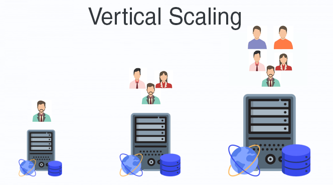
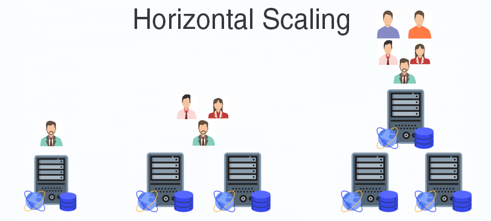
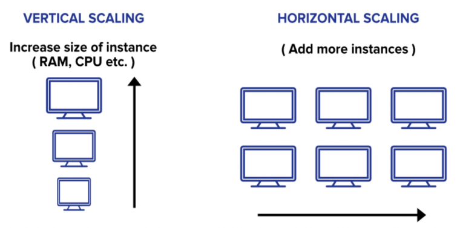

# Apache Zookeeper

> This is a tutorial course covering Apache Zookeeper.

Tools used:

- JDK 8
- Maven
- JUnit 5, Mockito
- IntelliJ IDE

## Table of contents

1. [Distributed Systems and Cluster Coordination](https://github.com/backstreetbrogrammer/45_ApacheZookeeper?tab=readme-ov-file#chapter-01-distributed-systems-and-cluster-coordination)
    - [Distributed Systems](https://github.com/backstreetbrogrammer/45_ApacheZookeeper?tab=readme-ov-file#distributed-systems)
    - [Scalability](https://github.com/backstreetbrogrammer/45_ApacheZookeeper?tab=readme-ov-file#scalability)
    - [Cluster Coordination](https://github.com/backstreetbrogrammer/45_ApacheZookeeper?tab=readme-ov-file#cluster-coordination)
2. [Zookeeper Installation and Setup](https://github.com/backstreetbrogrammer/45_ApacheZookeeper?tab=readme-ov-file#chapter-02-zookeeper-installation-and-setup)
3. Leader Election
4. Cluster Auto-Healer

---

## Chapter 01. Distributed Systems and Cluster Coordination

### Distributed Systems

A distributed system is a collection of computers that work together to form a **single computer** for the end-user.

All these distributed machines have **one shared state** and operate **concurrently**.

Features of a distributed system:

- **Fault tolerance**: Distributed systems components or nodes are able to **fail independently** without damaging the
  whole system
- Have a **shared network** to connect its components, which could be connected using an IP address or even physical
  cables
- **Scaling**: Distributed systems allow us to scale **horizontally,** so we can account for more traffic
- **Parallelism**: Distributed systems can be designed for parallelism, where multiple processors divide up a complex
  problem into pieces
- **Low latency**: Users can have a node in multiple locations, so traffic will hit the closet node
- **Efficiency**: Distributed systems break complex data into smaller pieces
- **Cost-effective**: The initial cost is higher than a traditional system, but because of their scalability, they
  quickly become more cost-effective

### Scalability

**Scalability** is the biggest benefit of distributed systems.

**Vertical scaling**

It is defined as the process of increasing the capacity of a single machine by adding more resources such as memory,
storage, etc. to increase the throughput of the system. No new resource is added, rather the capability of the existing
resources is made more efficient.

Example: `MySQL`

However, there is still a single point of failure. Also, there is a limit to the capacity of a single machine.

**Horizontal scaling**

It is defined as the process of adding more instances of the same type to the existing pool of resources and not
increasing the capacity of existing resources like in vertical scaling. This kind of scaling also helps in decreasing
the load on the server.

In this process, the number of servers is increased and not the individual capacity of the server. This is done with the
help of a **Load Balancer** which basically routes the user requests to different servers according to the availability
of the server. Thereby, increasing the overall performance of the system. In this way, the entire process is distributed
among all servers rather than just depending on a single server.

Example: NoSQLs like `Cassandra` and `MongoDB`

All the nodes are "**stateless**" meaning that each node doesn't maintain the state of client requests. In other words,
any node can serve client request without maintaining the state => however, the database can store all the client's
request and service states.

So we should choose vertical scaling or horizontal scaling based on the system architecture (big or small), user base,
web traffic expected, etc.

### Cluster Coordination

**_Terminology_**

- **Node**: Process running on a dedicated machine
- **Cluster**: Collection of computers / nodes connected to each other working on the same task and typically are
  running the same code
- **Coordination service**: A centralized service that helps in coordination between nodes and maintaining configuration
  information, distributed synchronization and providing group services
- **Zookeeper**: Using a coordination service like Apache Zookeeper, individual nodes can exchange information, and
  run higher level algorithms to work together as a logical cluster

When the same task is given to the cluster, it's challenging to decide and distribute the task across all the nodes.

We should have an algorithm to _automatically_ assign a node as `master node` or `leader` which will distribute the task
across the other nodes.

If the leader node goes down for whatever reason, the algorithm should automatically assign a new leader node until the
previous leader node gets up and gets reassigned as leader.

By default, each node knows only about itself => **Service registry** and **discovery** is required.

Also, **failure detection** mechanism is necessary to trigger automatic leader re-election in a cluster.

**_Apache Zookeeper_**

Zookeeper is a high-performance coordination service designed specifically for distributed systems.

**Key features:**

- Zookeeper is a distributed system itself that provides us with high availability and reliability
- Typically runs in a cluster of an odd number of nodes, higher than 3
- Uses redundancy to allow failures and stay functional
- Nodes communicate with each other using Zookeeper cluster

**Zookeeper Data Model**

ZooKeeper has a hierarchical **name space**, much like a distributed file system.

The only difference is that each **node** in the **namespace** can have data associated with it as well as **children**.

It is like having a file system that allows a **file** to also be a **directory**.

**Paths** to nodes are always expressed as canonical, absolute, slash-separated paths; there are no relative references.

**Znodes**

Every node in a ZooKeeper tree is referred to as a `znode`.

Znodes maintain a **stat structure** that includes **version numbers** for data changes and also has **timestamps**.

The **version number**, together with the **timestamp**, allows ZooKeeper to validate the cache and to coordinate
updates.

Each time a znode's data changes, the version number increases.

For instance, whenever a client **retrieves** data, it also receives the **version** of the data.

And when a client performs an **update** or **delete**, it must supply the **version** of the data of the znode it is
changing.

If the version it supplies doesn't match the actual version of the data, the update will **fail**.

**Key features of Znodes:**

- **Watches**: Clients can set watches on znodes. Changes to that znode trigger the watch and then clear the watch. When
  a watch triggers, ZooKeeper sends the client a notification.
- **Data Access**: The data stored at each znode in a namespace is read and written atomically. Reads get all the data
  bytes associated with a znode and a write replaces all the data. Each node has an **Access Control List (ACL)** that
  restricts who can do what.

**Two types of Znodes:**

- **Persistent** - persists between sessions
- **Ephemeral** - deleted when the session ends

**Leader Election Algorithm**

- Every node that connects to Zookeeper volunteers to become the leader by adding itself as a znode `children` of the
  `/election` parent znode
- Zookeeper maintains an ascending order or sequence number for each of the znode `children` based on connection time
- The znode children with the lowest sequence number will automatically become a leader as all the other znodes
  connected later will know that there are znodes already connected before. Only the first connected znode will not see
  any other znodes and thus will assign itself as leader.
- Similarly, whichever znode is currently assigned the lowest sequence number will automatically become the leader
  in case a previous leader goes down.

---

## Chapter 02. Zookeeper Installation and Setup

